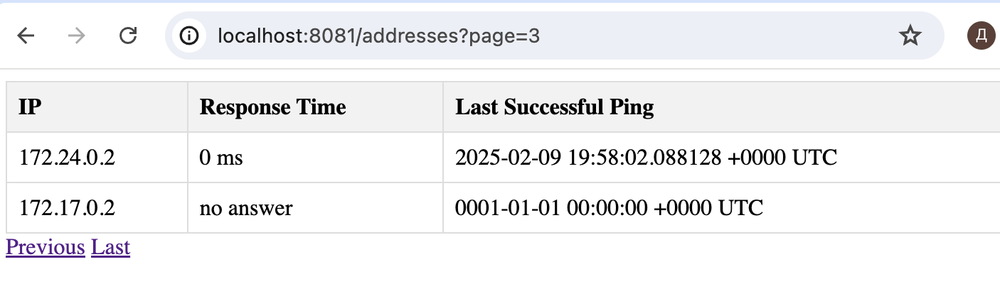

# Краткий обзор проекта
- Здраствуйте, во первых хотелось бы по благодорить за интерестное тестовое задание.
  Оно одновременно и небольшое, и охватывает разные области, особенно хорошо на его 
  примере видно как нужно работать с архитектурой сервисов, для пингера можно
  не заморачиваться с архитектурой, это маленькая и узнонаправленная программа,
  тут не нужна ни чистая, ни слоистая архитектура. В тоже время для backend сервиса
  уже нужны слои чтобы отделить бизнес логику.  

- Данный проект представляет из себя сервис сбора информации о запущенных docker контейнерах, состоящий из двух микросервисов:
 1) Backend cервис
 2) Сервис пингер
 
 - Backend cервис представляет собой веб-приложение, которое обрабатывает запросы на создание 
   и получение информации о запущенных контейнерах. Он использует базу данных PostgreSQL
   для хранения данных и предоставляет HTTP API для взаимодействия с клиентами.
   При выдаче используется пагинация, что бы не выгружать всю базу сразу.
    - Основные компоненты:
        - config:
        Сервис загружает конфигурацию из файла config.yaml, 
        который содержит настройки для подключения к базе данных и настройки сервера.
        - Логирование:
        Используется пакет slog для логирования информации и ошибок. C возможностью 
        настроить уровень логирования через config
        - HTTP-ручки:
        handlerы реализуют логику для обработки HTTP-запросов, таких как создание 
        адресов и получение списка адресов.
        - Слой репозитория:
        Слой репозитория (repository) отвечает за взаимодействие с базой данных, 
        включая создание и выдачу данных о пингах. Для работы с бд используется sqlx
        - Слой использования:
        Слой использования (usecase) содержит бизнес-логику, которая связывает handlerы и репозиторий.
        - HTTP-сервер:
        Сервис использует стандартный HTTP-сервер для обработки входящих запросов.

 - Сервис Pinger предназначен для мониторинга доступности контейнеров в Docker,
   отправляя TCP-пинги на их IP-адреса и порты. Он собирает информацию о времени 
   отклика и отправляет её на backend. Для каждого контейнера извлекаются его IP-адреса
   и открытые порты, после чего адреса отправляются в канал jobs для обработки воркерами.
   Для логирования используется логгер logrus, с настраиваемыми уровнями логирования,
   уровни логирования задаются через config. Каждые 20 секунд сервис запрашивает список
   запущенных контейнеров Docker, извлекает их IP-адреса и открытые порты, и отправляет их в канал jobs.
   В этом сервие я пытался(и на мой взгляд успешно) реализовал несколько патерновп роектирования:
    - Worker Pool (Пул воркеров):
      Используется для обработки пингов в параллельных потоках. Воркер получает задания
      из канала и выполняет их, что позволяет эффективно использовать ресурсы.
      И не ждать все таймауты последовательно.
    - Observer (Наблюдатель):
      Сервис наблюдает за состоянием контейнеров и обновляет информацию о них на сервере.
      Это можно рассматривать как паттерн наблюдателя, где сервис "наблюдает" за состоянием
      контейнеров и уведомляет о результатах backend.
    - Singleton (Одиночка):
      Конфигурация загружается один раз в начале работы приложения и используется везде.
    - graceful shutdown:
      Используется для управления временем жизни воркеров и обработки сигналов завершения.
      Это позволяет корректно завершать работу сервиса при получении сигнала.
      

# Инструкция для запуска

- Запускаем make. Ожидаем когда поднимутся контейнеры.
- Проверяем, что все заработало (docker ps).
- Отрываем бразуер и переходим по адресу: http://localhost:8081/addresses.
- Мы увидем не большую табличку с тестовыми данными, скоро тут появяться данные о запущенных контейнерах

- Кроме контейнеров бекенда и бд поднинуться ещё 2 контейнера с nginx для примера работы
  одим из них будет пинговаться, а второй нет.